# FLOW.md

## 1. 首頁主要流程

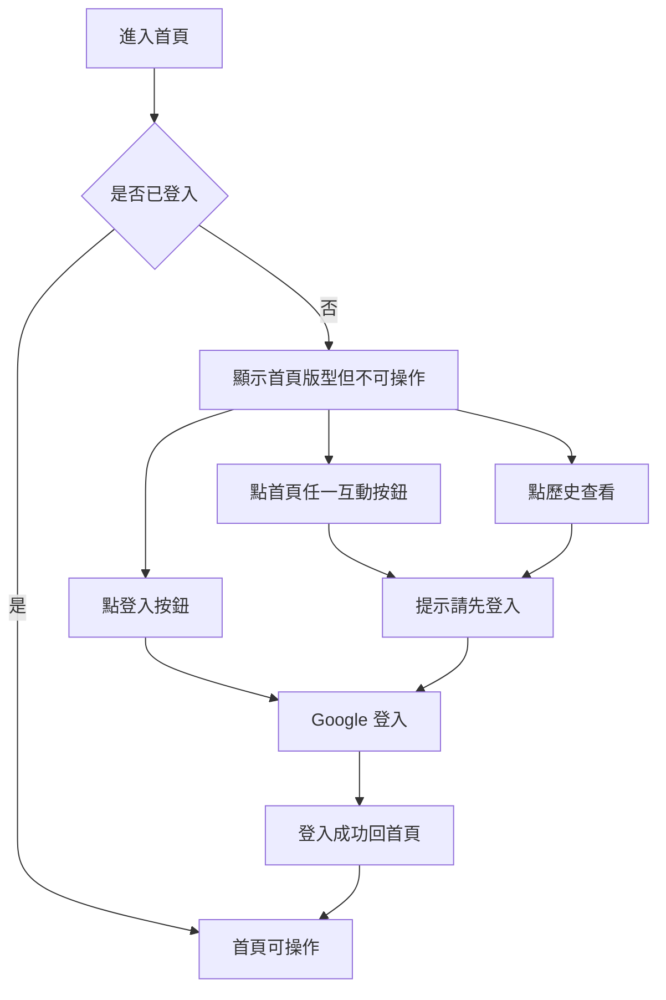

## 1.1 首頁統計類型切換流程

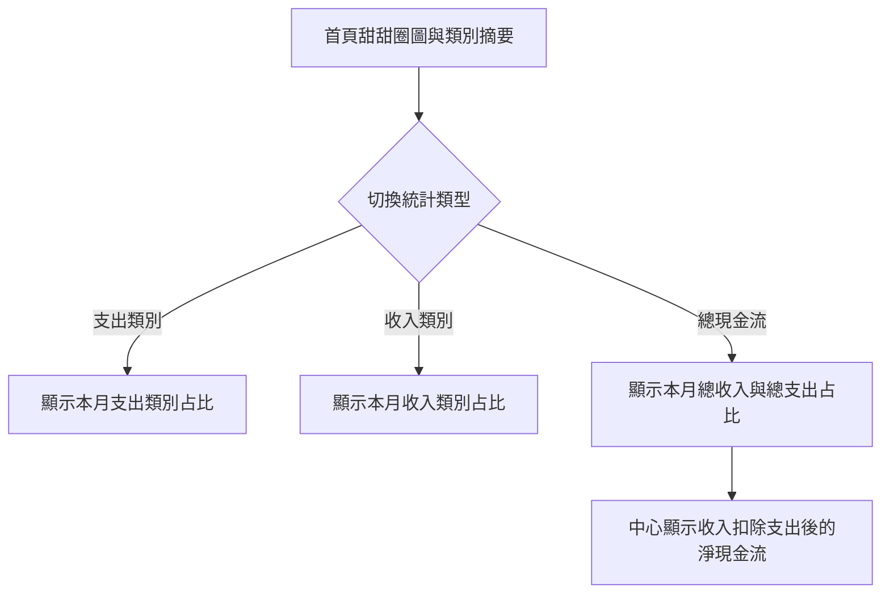

## 2. 首頁批次新增流程

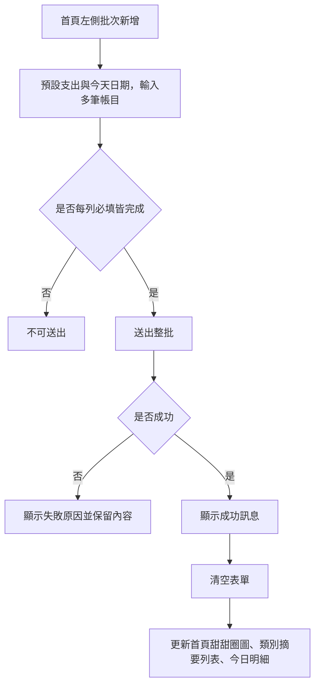

## 3. 首頁今日明細流程

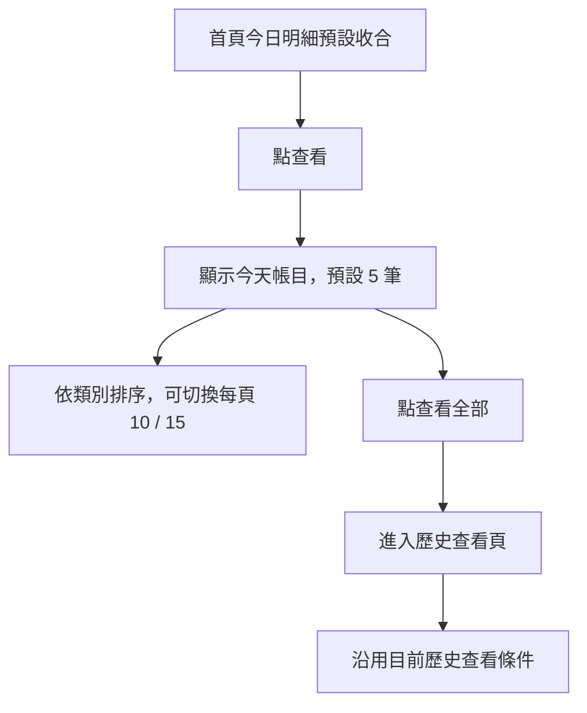

## 4. 歷史查看主要流程

```mermaid
flowchart TD
A[進入歷史查看頁] --> B[套用預設條件]
B --> C[日期區間：本月第一天至今天]
B --> D[類型：支出類別]
B --> E[趨勢圖：當年度每月總現金流與累積總現金流]
C --> F[左側明細載入]
D --> G[右上甜甜圈圖載入]
E --> H[右下折線圖載入]
F --> I[全頁同步顯示]
G --> I
H --> I
```

## 5. 歷史查看查詢同步流程

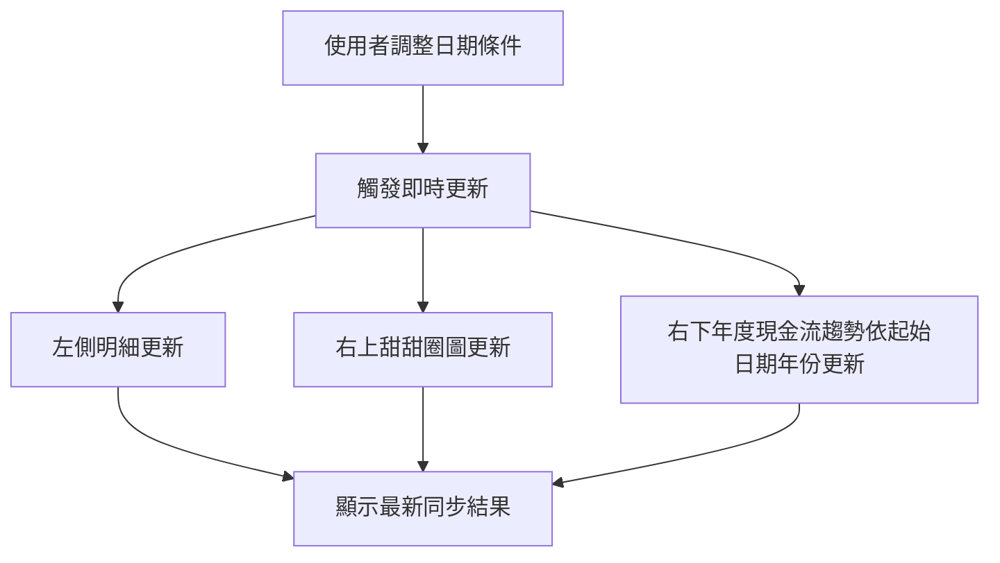

## 6. 歷史查看圖表類型切換流程

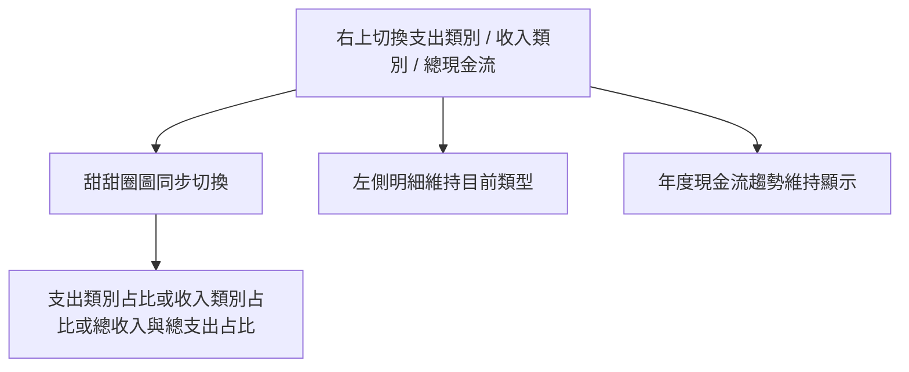

## 7. 歷史查看明細操作流程

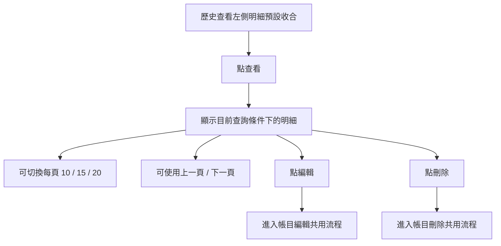

## 8. 帳目編輯共用流程

適用範圍：歷史查看明細。

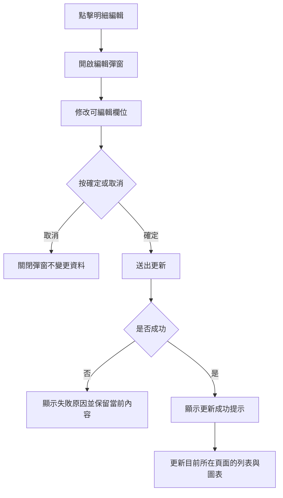

## 9. 帳目刪除共用流程

適用範圍：歷史查看明細。

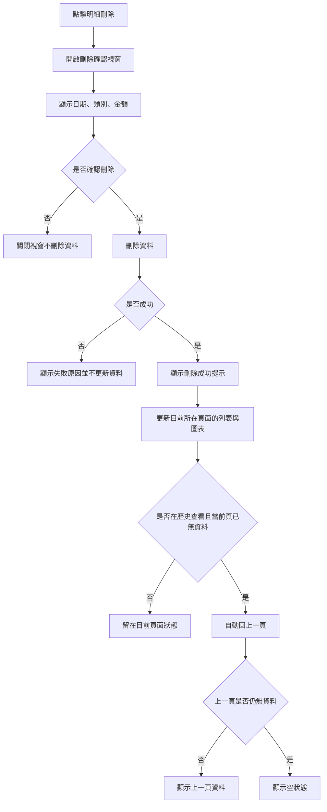

## 10. 單日查詢流程

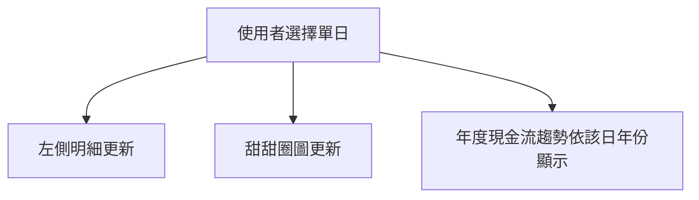

## 11. 無資料流程

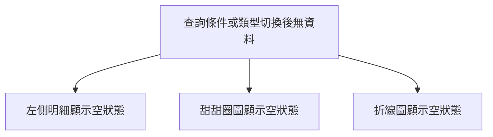
