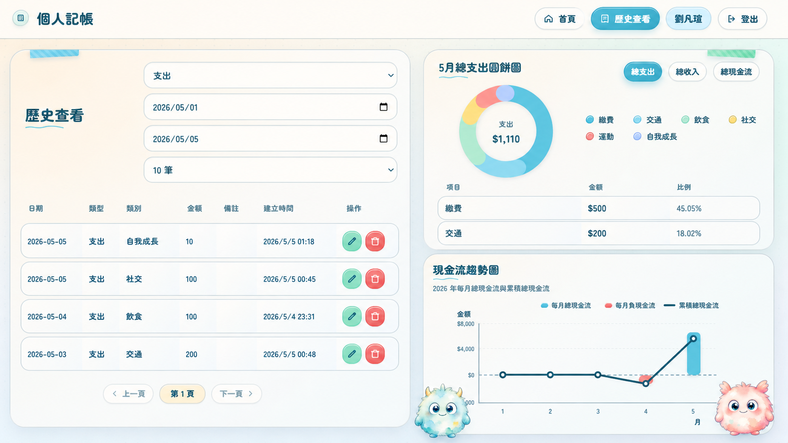

# Personal Accounting App

個人記帳 Web App，用來快速記錄收入與支出，並透過首頁摘要、最近明細、歷史查詢與現金流趨勢，查看自己的消費與收入狀況。

<p align="center">
  
</p>

## 目前狀態

本專案目前以 V2 文件為準，主線架構為：

```text
Vue 3 前端
  -> Cloudflare Worker API
  -> Supabase Postgres
```

登入驗證使用 Firebase Authentication 的 Google 登入。前端取得 Firebase ID token 後，呼叫 `/api/...`，由 Worker 驗證 token 並以 Firebase uid 隔離使用者資料。

## 功能

- Google 登入與登出。
- 依使用者隔離個人帳目。
- 批次新增收入與支出。
- 首頁查看本月類別摘要、甜甜圈圖與最近明細。
- 歷史查看依日期區間查詢帳目。
- 歷史查看支援類別分布與年度現金流趨勢。
- 在歷史查看頁編輯與刪除單筆帳目。
- 支援預設類別與新增自訂類別。

## 技術棧

| Layer | Tech |
| --- | --- |
| Frontend | Vue 3, Vite, TypeScript |
| Auth | Firebase Authentication |
| API | Cloudflare Workers |
| Database | Supabase Postgres |
| Deploy | Cloudflare Pages, Cloudflare Workers |

## 專案結構

```text
frontend/   Vue 3 前端
worker/     Cloudflare Worker API
docs/v2/    目前版本產品、架構、API、測試與 AI 協作文件
```

## 本機開發

詳細規則請看 [`docs/v2/07-development.md`](./docs/v2/07-development.md)。

安裝前端依賴：

```powershell
cd frontend
npm install
```

安裝 Worker 依賴：

```powershell
cd worker
npm install
```

啟動本機 Worker：

```powershell
cd worker
npm run dev:local
```

啟動前端：

```powershell
cd frontend
$env:VITE_API_PROXY_TARGET='http://localhost:8787'
npm run dev -- --host localhost
```

開啟：

```text
http://localhost:5173
```

Firebase 本機登入請使用 `localhost`。

## 測試

前端 build：

```powershell
cd frontend
npm run build
```

前端日期格式測試：

```powershell
cd frontend
npm run test:date-format
```

Worker type check：

```powershell
cd worker
npm run typecheck
```

Worker 測試：

```powershell
cd worker
npm test
```

完整測試策略請看 [`docs/v2/08-testing.md`](./docs/v2/08-testing.md)。

## 文件

V2 文件是目前專案的主要依據：

- [`docs/v2/00-current-status.md`](./docs/v2/00-current-status.md)：目前系統狀態入口。
- [`docs/v2/01-product-spec.md`](./docs/v2/01-product-spec.md)：產品規格。
- [`docs/v2/02-wireframe.md`](./docs/v2/02-wireframe.md)：版面輔助。
- [`docs/v2/03-architecture.md`](./docs/v2/03-architecture.md)：系統架構。
- [`docs/v2/04-api.md`](./docs/v2/04-api.md)：API 契約。
- [`docs/v2/05-database.md`](./docs/v2/05-database.md)：資料庫規則。
- [`docs/v2/06-env.md`](./docs/v2/06-env.md)：環境變數。
- [`docs/v2/07-development.md`](./docs/v2/07-development.md)：本機開發。
- [`docs/v2/08-testing.md`](./docs/v2/08-testing.md)：測試策略。
- [`docs/v2/09-deployment.md`](./docs/v2/09-deployment.md)：部署。
- [`docs/v2/AGENTS.md`](./docs/v2/AGENTS.md)：AI 協作規則。

## 範圍

目前目標是個人記帳 MVP。預算管理、週期性帳目、匯入匯出、多幣別、共享帳本、OCR、AI 分析、通知與手機 App 等功能不在目前範圍內。
